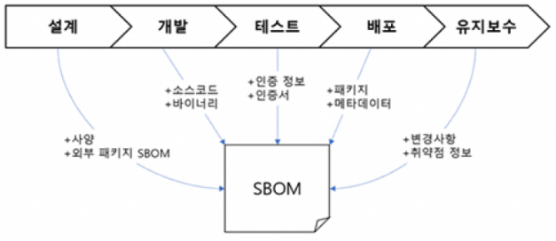

# SBOM(Software Bill of Materials)

-   정의 및 의의

    -   소프트웨어 구성요소의 메타데이터를 정형화하여 기술한 목록
    -   SBOM은 소프트웨어의 공급망 보안을 강화하기 위해 사용되는 중요한 도구

-   SBOM 정보 - 구성요소의 이름, 버전, 공급업체 - 구성요소의 파일 이름, 경로, 크기 - 구성요소의 의존 관계 - 구성요소의 보안 취약점 정보

 [출처](https://blog.skby.net/sbom-software-bill-of-materials/) 

-   SBOM 생성 방법

    -   수동: 소프트웨어의 코드, 라이브러리, 이진 파일을 수동으로 분석하여 정보를 수집
    -   자동으로: 소프트웨어의 구성요소를 식별하고 정보를 수집하는 도구를 사용

-   SBOM의 목적

    -   소프트웨어의 공급망 보안을 평가
    -   소프트웨어의 보안 취약점을 식별하고 관리
    -   소프트웨어의 라이선스 준수를 검토

-   SBOM의 요구사항
    -   하드웨어에서 판독이 가능하도록 SPDX, SWID, CycloneDX의 표준화된 형식 중 하나로 작성
    -   새로운 소프트웨어 버전마다 새로운 SBOM 생성하여 최신 상태를 보장
    -   종속성 관계 설명 및 관계 존재 가능성 설명
